# JUMPER OPDRACHT README

Welkom bij het Jumper Project, een samenwerkingsverband tussen Haitam Baqloul en Maximilian Duda. Dit project is een boeiende verkenning van de mogelijkheden van machine learning binnen de Unity-omgeving, met de focus op het ontwikkelen van een intelligente agent die de vaardigheid leert om over obstakels te springen.

## Projectoverzicht

In dit project gebruiken we de ML-Agents Toolkit van Unity om een virtuele bol te trainen die autonoom over dynamisch geplaatste obstakels kan springen. Het doel is om te demonstreren hoe technieken van reinforcement learning toegepast kunnen worden op eenvoudige maar uitdagende taken in een gesimuleerde 3D-ruimte.

## Doelstellingen

- MLAgent package manager: Een beschrijving dat helpt bij het installeren van de MLAgent packets die wij nodig gaan hebben.
- Tutorial: Stap voor stap uitleg hoe je de jumper project moet namaken.
- Scripts uitleg: Hier gaan we bij elke script een kort uitleg geven over hoe het werkt.
- Training via Anaconda: Een stapsgewijze gids voor het instellen van de training van de agent met Anaconda.
- Resultaten: Evaluatie van de prestaties van de agent, met een bespreking van de resultate.

## MLAgent package manager

Maak een nieuwe 3d project aan via unity. Eens je project geladen is ga naar window>packet manager.

Eens je de packet manager open hebt ga naar Unity Registry.
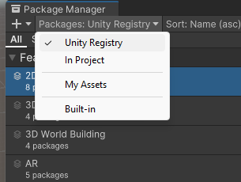
Scroll tot je ML Agents vind en druk op install.
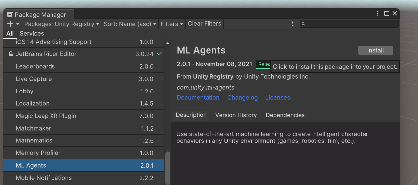

## Tutorial

Floor(grijs): maak een cube aan die ons vloer gaat zijn.
MLPlayer(groen): Een cube die onze jumper zou zijn.
Obstacle(rood): Een cube dat kleiner en breeder is dan de MLPlayer.
Het zou er zo moeten uitzien.

Hierna gaan wij een muur achter de MLAgent plaatsen die gaat zorgen dat de obstakel gaat verdwijnen eens die in contact komen.
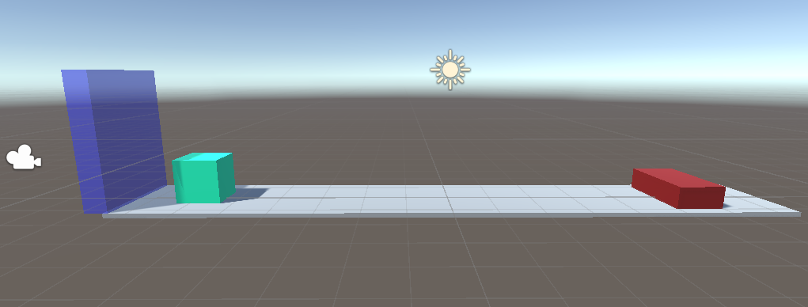
Nu gaan we een script toevoegen aan de obstacle die gaat zorgen voor de delete bij contact met muur of MLAgent.

Voeg dit toe aan de obstacle en voeg een Rigid Body component aan de Obstacle.
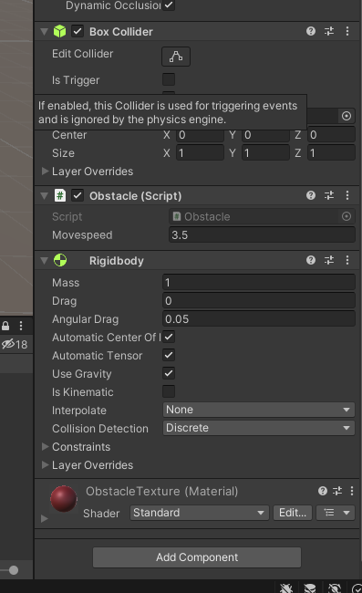
Nu gaan wij aan de MLPlayer een script toevoegen die de Obstale gaaat verwijderen bij contact. Wij voegen er ook extra values aan toe die we later nodig gaan hebben.
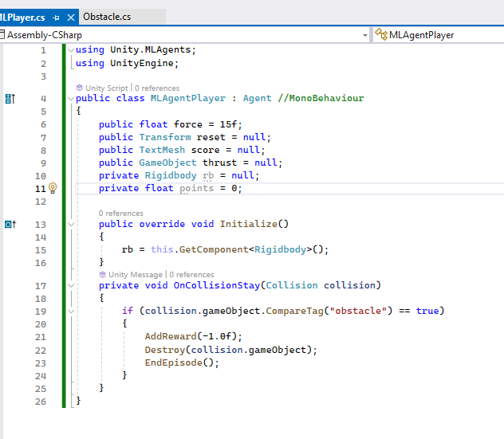
MLPlayer:
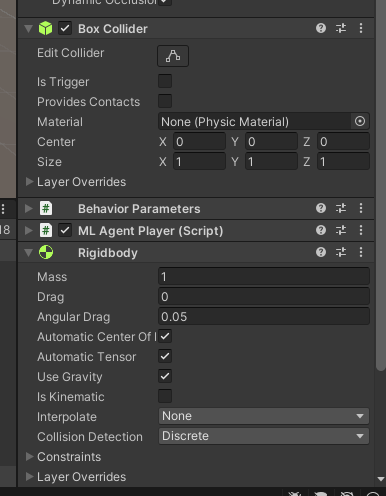
Nu moeten we de obtascles een prefab maken. Dit doe je door de obstacle object te draggen naar je assets.
Wij gaan van de floor een obstacle spawner maken. Voeg deze script aan de floor object.

Maak een spawnpoint aan als kind van floor en plaats die op de obstacle spawn plaats.
Voeg ook de prefab van de obstacle aan de spawner script.

Nu gaan wij van de MLPlayer een werkelijke MLAgent maken met deze script.
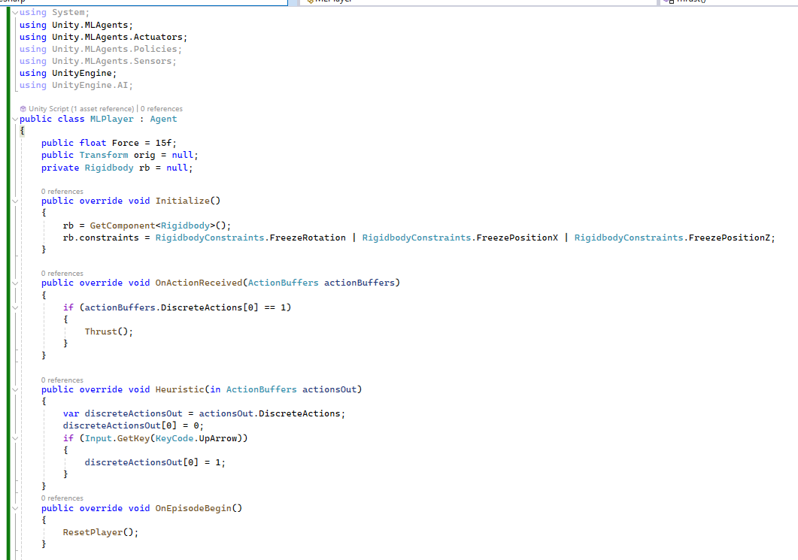
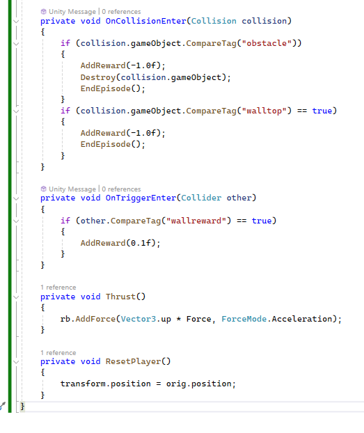
Maak een nieuwe empty object aan. Deze noem je reset en gaat de resetpunt zijn voor de MLPlayer (dus zelfde position als MLPlayer).

Daarna gaan wij de decision requester component toeveogen aan MLPlayer. We zetten de Desicion Period op 1.

Zoals je al misschien in de MLPlayer code hebt ondekt is er ook een wallreward. Deze gaan wij nu toevoegen. Deze gaat zich achter de obstacle bevinden en zorgt ervoor dat de agent weet dat gij volledig over de obstacle is gesprongen door de wallreward te raken.
Maak een cube aan die een kind is van obstacle en noem het wallreward.

Zet deze achter de obstacle en maak het langer dan de obstacle.

Duid "is trigger" aan voor wallreward en voeg de wallreward tag aan WallReward object.
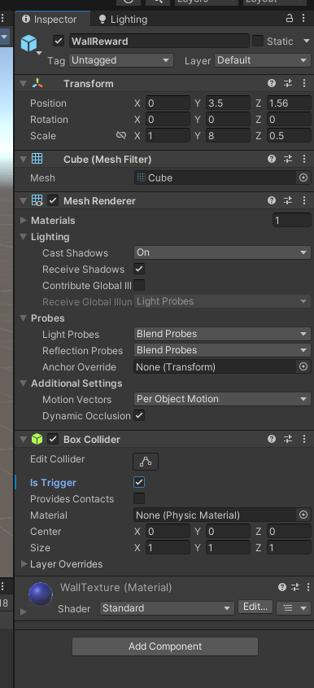
Hierna gaan we aan de MLPlayer het Ray Perception Sensor 3d component geven.
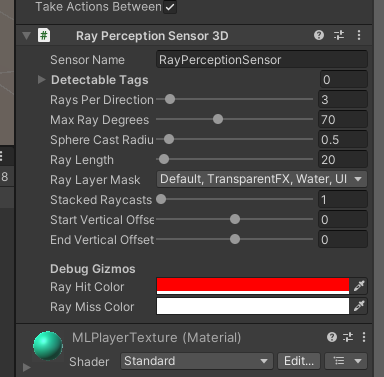
We gaan dan ook de MLPlayer met 90 graden op de Z-axis roteren zodat de rays naar boven wijzen.
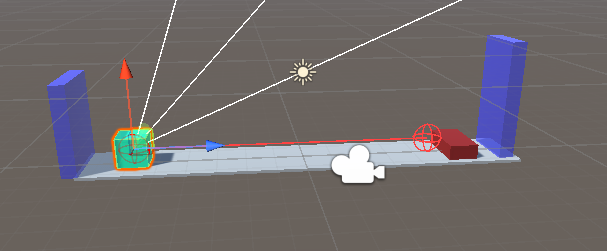
Daarna gaan we een wall boven de MLPlayer plaasten zodat hij niet te hoog gaat kunnen springen. Deze gaan we de tag walltop geven
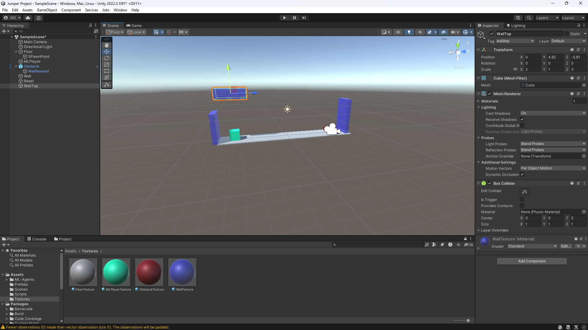
Hierna gaan we alle aangemaakte tags toevoegen aan de Ray Perception sensors.
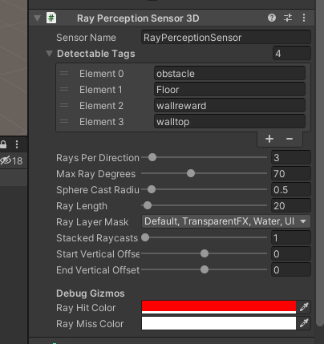

Hiermee is de omgeving klaar en kan je jou MLAgent trainen via Anaconda. Maar eerst wat meer uitleg voor elke script.

## Scripts uitleg

In deze simpele script kunt u zien. Hoe er elke keer een prefab inspawnt op de locatie naar u keuze. U geeft een een prefab mee als parameter en ook de spawnpositie met erbij ook random timer wanneer de volgende moet inspawnen.

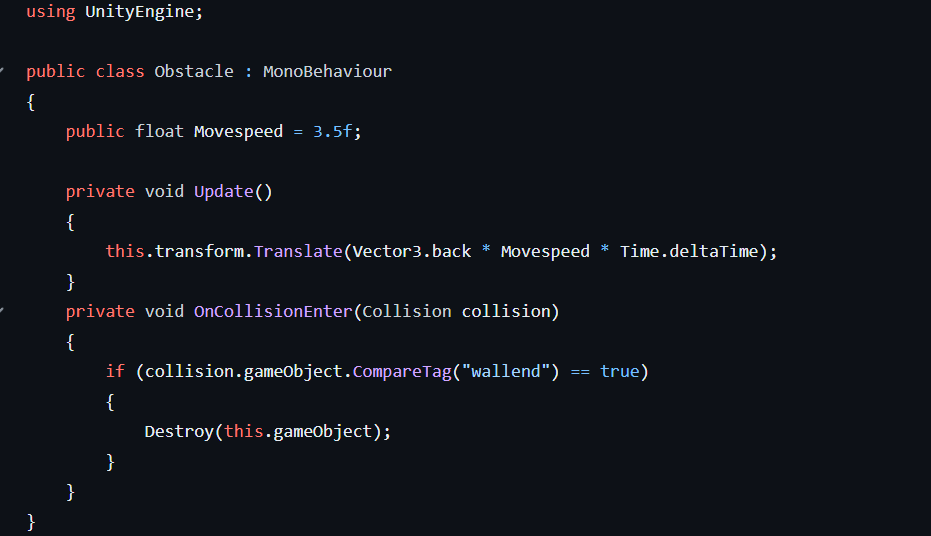
Dit is de script voor de obstakel. Er wordt dankzij de spawner script elke keer een object inspawnt dat het collission kan maken met het object met die specifeke tag. We laten het object naar voor bewegen met de snelheid naar keuze. Als er een collission is met die tag word het object vernietigd. Zo gaat het process heeltijd door.

Dit is de belangrijkste script van het project. Dit is hoe wij de Agent trainen om te laten jumpen over obstakels.
Als eerst gaan we overerven van de klasse agent

Dit zijn de variables die je nodig zult hebben. De kracht van de jump van de Agent, dat die op zijn plek blifjt =reset, zijn sprong omhoog, het rigidbody object zelf. De rb is nodig om de physics van de Agent te beheren.

Deze methode wordt aangeroepen wanneer de agent geïnitialiseerd wordt. Hier haal je de Rigidbody-component op en roep je ResetMyAgent aan om de startcondities in te stellen.
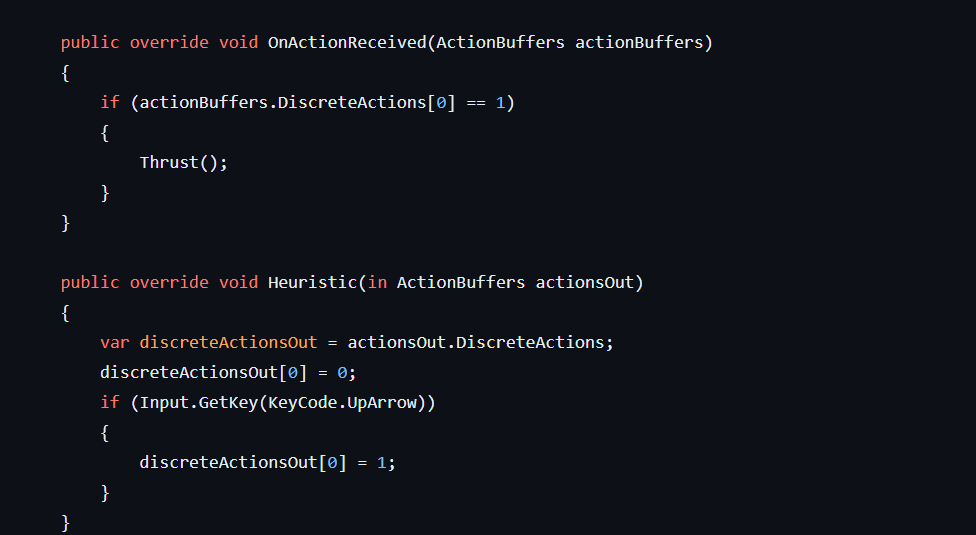
Verwerkt de acties die door het neurale netwerk zijn besloten. Als vectorAction[0] 1 is, activeer je de springkracht en laat je het thrust GameObject zien.
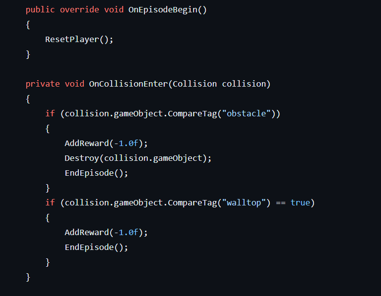
Wordt aangeroepen bij het begin van elke nieuwe episode. Hier reset je de agent naar zijn oorspronkelijke positie.

De onTriggerEnter methode verwerkt het binnengaan van een triggerzone. Als het de wallreward tag detecteert, voegt het punten toe en actualiseert de score op het scherm.
Upforce methode, past een opwaartse kracht toe op de Rigidbody, wat de agent doet springen.
De ResetMyAgent, reset de positie van de agent naar een specifieke locatie die is opgeslagen in de reset Transform.

## Training via Anaconda

Doe anaconda aan. Ga in terminal en ga naar de asset folder van je project.

Voer daarna deze lijn uit.

Eens je dit invoert en entered zal je un unity op play drukken. Eens dat gebeurt is zal de training beginnen.
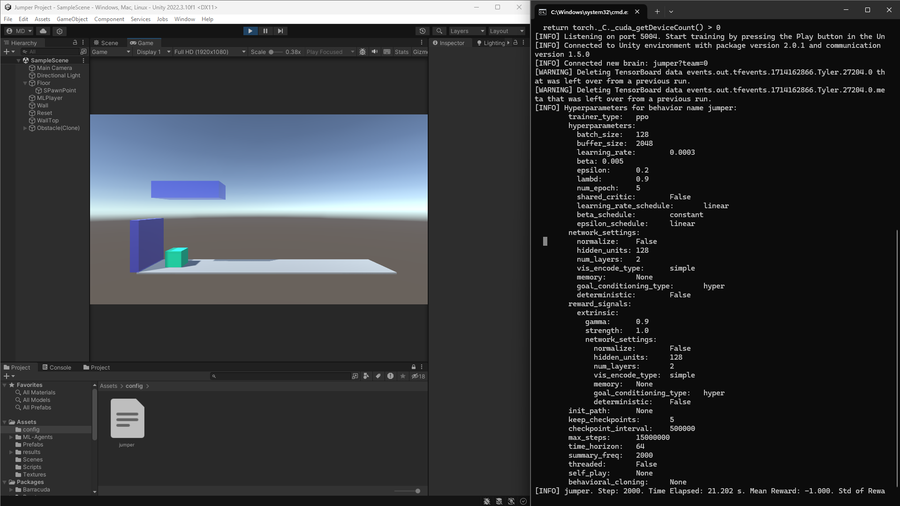
Maar met maar een MLPlayer zal deze training process zeer lang duren dus gaan we er een prefab van maken en meerdere MLPlayers trainen tegelijkertijd.
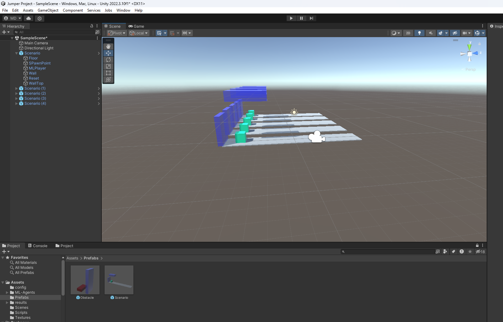
Je kan de obstacle obect verwijderen want het word toch gespawned. Je maakt van de rest een prefab en voeg je er meerdere in. Hoe meer hoe sneller de training gaat gaan.

## Resultaten

Bij 30k steps ging het opeens heel goed maar na 80k steps bleef het opeens op -0.5. Dit komt waarschijnlijk door mijn laptop die niet echt sterk is. Mijn laptop heeft geen GPU waardoor trainen van deze MLAgent heel langzaam en fout ging na een tijdje. Maar de code en logica van ons project is wel correct.
